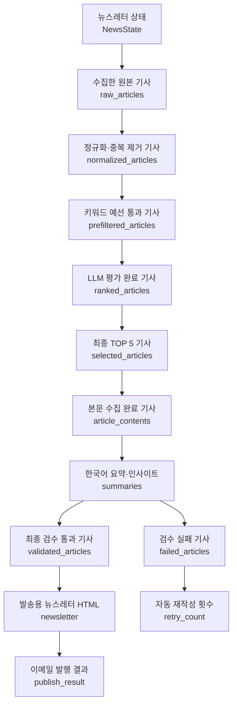
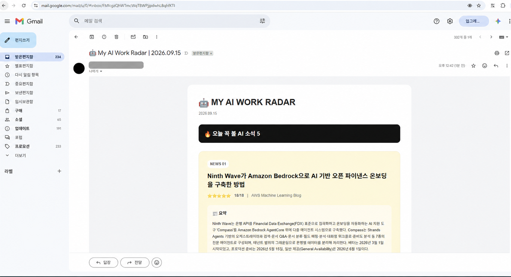

# My AI Work Radar

## LangGraph 기반 AI 업무 뉴스레터 에이전트

My AI Work Radar는 여러 기술 블로그에서 AI·업무자동화 뉴스를 수집하고, 독자 적합성과 실무 활용성을 기준으로 핵심 기사 5개를 선별한다. 선별한 기사는 원문 기반 요약과 실무 인사이트로 가공하고, 자동 검수 후 이메일 뉴스레터로 발행한다.

---

## 1. 분야 및 독자 정의

### 1.1 분야 선택 배경

AI 뉴스는 빠르게 증가하지만 비개발자 실무자가 자신의 업무에 바로 적용할 만한 정보를 골라 읽기는 어렵다. 단순한 기술 동향 나열보다 “무슨 변화가 있었는가 → 왜 중요한가 → 내 업무와 어떤 관계가 있는가 → 오늘 무엇을 시도할 수 있는가”를 연결하는 정보 가공이 필요하다고 판단했다.

이에 프로젝트 분야를 `AI Agent와 업무자동화`로 정하고, 다음 네 단계의 정보 가공 원칙을 적용했다.

> Fact → Meaning → Relevance → Action

- Fact: 원문에서 확인되는 사실
- Meaning: 기술·산업 흐름에서의 의미
- Relevance: 독자의 실제 업무와의 관련성
- Action: 독자가 바로 시도할 수 있는 구체적 행동

### 1.2 타깃 독자 페르소나

| 항목 | 정의 |
|---|---|
| 가상 독자 | 업무자동화에 관심 있는 비개발자 실무자 |
| 배경 | AI Agent를 학습 중이며 기술 용어에는 익숙하지 않음 |
| 목표 | AI 기술을 문서 작성, 정보 수집, 반복 업무 개선에 적용 |
| 어려움 | 뉴스 양이 많고 기술 설명이 복잡해 우선순위를 정하기 어려움 |
| 기대 결과 | 핵심 기사 5개와 실무 의미, 당일 적용 아이디어를 한 번에 확인 |

이 페르소나를 기준으로 화제성보다 실무 활용성, AI Agent 관련성, 이해 가능성을 우선했다.

---

## 2. 소스 채택표

### 2.1 측정 방식

후보 RSS를 실제로 호출해 소스별 최신 게시물을 최대 30개까지 비교했다. 다음 항목을 근거로 채택 여부를 결정했다.

1. RSS 자동 수집 가능 여부
2. 최근 게시물 존재 여부
3. 관심 키워드가 포함된 기사 비율
4. 최종 뉴스레터의 주제 다양성 기여도

관심 키워드는 AI Agent, Agentic AI, LangGraph, MCP, Automation, Workflow, RAG, Local LLM, Document AI, Tool Use, Multi-Agent 등으로 구성했다.

### 2.2 전체 후보 측정 결과

| 소스 후보 | 비교 기사 수 | 관심 기사 수 | 적중률 | 결정 | 수치적 근거 |
|---|---:|---:|---:|---|---|
| Google Cloud Blog | 20 | 19 | 95.0% | 채택 | 적중률 1위, Enterprise AI·Agent·RAG 비중이 매우 높음 |
| AWS Machine Learning Blog | 20 | 8 | 40.0% | 채택 | 실무 사례와 Agentic AI 관련성이 높음 |
| NVIDIA Blog | 18 | 4 | 22.2% | 채택 | Local AI·AI Infrastructure 관점을 보완 |
| Cloudflare Blog | 20 | 3 | 15.0% | 채택 | MCP·보안·자동화 주제를 보완 |
| Hugging Face Blog | 30 | 3 | 10.0% | 탈락 | 수집은 안정적이나 관심 주제 적중률이 상대적으로 낮음 |
| LangChain Blog | 0 | 0 | 0.0% | 탈락 | 실험 시점 RSS 수집 결과가 0건 |
| Microsoft AI Blog | 0 | 0 | 0.0% | 탈락 | 실험 시점 RSS 수집 결과가 0건 |

최종적으로 Google Cloud, AWS, NVIDIA, Cloudflare의 4개 소스를 채택했다. 적중률뿐 아니라 기업 활용 사례, 로컬 AI, 인프라, 보안과 MCP가 함께 포함되도록 주제 다양성을 고려했다.

---

## 3. 선별 로직 설계

### 3.1 중요도 판단 문장

> 이 기사가 AI Agent와 업무자동화를 배우는 비개발자 실무자에게 실제 적용 아이디어를 주며, 새롭고 영향력 있고 신뢰할 수 있는가?

이 문장을 기준으로 기사마다 실무 활용성, AI Agent 관련성, 새로움, 영향력, 신뢰도를 평가했다.

### 3.2 예선: 규칙 기반 Prefilter

수집 기사 전체를 LLM에 보내지 않고 제목과 RSS 요약에서 관심 키워드를 먼저 탐지했다. 초기에는 단순 부분 문자열 방식 때문에 `WARDOGS` 안의 `rag`가 RAG로 잘못 인식되는 오탐이 발생했다. 이를 정규식 단어 경계 방식으로 수정해 독립된 키워드만 탐지하도록 개선했다.

개선 전에는 문자열 안에 포함되기만 해도 키워드로 판정해 `WARDOGS`의 일부인 `rag`까지 후보로 포함했다. 개선 후에는 정규식 단어 경계(`\b`) 안에서 독립된 `RAG`만 일치하도록 바꾸어 이 오탐을 제거했다. 이 변경에 대해 별도의 전·후 전체 기사 수는 측정하지 않았으므로 근거 없는 수치 비교는 제시하지 않고, 재현된 오탐 사례가 제거된 사실을 개선 근거로 삼았다.

실제 실행 결과는 다음과 같다.

> 78개 수집 → 34개 예선 통과(43.6%)

예선은 명확한 규칙을 Python이 담당하게 함으로써 불필요한 LLM 호출을 줄이고 본선 후보의 주제 관련성을 높였다.

### 3.3 본선: LLM 기반 Ranking

예선을 통과한 기사는 다음 배점으로 평가했다.

| 평가 기준 | 배점 | 판단 질문 |
|---|---:|---|
| 실무 활용성 | 0~5 | 실제 업무 적용 또는 아이디어 도출에 유용한가? |
| AI Agent 관련성 | 0~5 | Agent, MCP, RAG, Workflow, Automation과 직접 관련되는가? |
| 새로움 | 0~3 | 새로운 기술, 기능, 사례 또는 변화가 있는가? |
| 영향력 | 0~3 | AI 활용 방식이나 업무자동화에 미치는 영향이 큰가? |
| 신뢰도 | 0~2 | 출처와 내용의 신뢰성이 높은가? |
| 합계 | 0~18 | 다섯 항목의 합계 |

LLM은 항목별 의미 판단과 한 문장의 선정 근거를 생성한다. 총점은 LLM 응답값을 그대로 믿지 않고 Python이 다시 계산해 산술 오류가 기사 순위에 영향을 주지 않도록 했다. 점수순으로 정렬한 뒤 최종 TOP 5를 선정했다.

### 3.4 Batch 크기를 5로 설정한 이유

본선 평가는 `batch_size = 5`로 구현했다. 한 번의 요청에 너무 많은 기사를 넣으면 입력이 길어지고 JSON 응답 누락이나 기사 ID 혼동 위험이 커진다. 반대로 한 기사씩 평가하면 호출 횟수와 대기 시간이 과도하게 증가한다.

5개 묶음은 다음 균형을 위한 선택이다.

- 같은 묶음 안에서 기사 간 상대 비교 가능
- 기사별 제목·출처·요약과 평가 기준을 충분히 포함
- JSON 배열 파싱과 `article_id` 매핑을 단순하게 유지
- 34개 후보를 7회 호출로 처리해 호출 비용과 지연을 제한
- 배치 실패 시 해당 5개 범위만 식별해 복구 가능

---

## 4. 파이프라인 구조도

### 4.1 LangGraph 전체 아키텍처

```mermaid
flowchart LR
    START((START)) --> C[Collect<br/>4개 RSS에서 최신 기사 수집]
    C --> N[Normalize & Dedupe<br/>HTML 정리·중복 제거]
    N --> P[Prefilter<br/>관심 키워드 예선]
    P --> R[Rank<br/>5개 Batch·18점 평가]
    R --> S1[(ranked_articles)]
    S1 --> T[TOP 5 선정]
    T --> F[Fetch Content<br/>기사 원문 수집]
    F --> S2[(article_contents)]
    S2 --> S[Summarize<br/>Fact·Meaning·Relevance·Action]
    S --> V[Validate<br/>Python 형식 + LLM 의미 검수]
    V -->|PASS| C1[Compose<br/>HTML 뉴스레터]
    V -->|FAIL| RW[Rewrite<br/>1회 자동 재작성]
    RW --> V2[Revalidate]
    V2 -->|PASS| C1
    V2 -->|FAIL| SKIP[해당 기사만 SKIP]
    SKIP --> C1
    C1 --> PUB[Publish<br/>Gmail SMTP 발행]
    PUB --> END((END))
```

### 4.2 State 흐름

모든 노드는 `NewsState`를 공유하며 필요한 필드를 읽고 다음 단계의 결과를 추가한다.

검수 단계의 FAIL이 전체 중단으로 이어지지 않도록 `재작성 → 재검수 → 그래도 실패하면 해당 기사만 SKIP`하는 Fail-safe를 적용했다.

### 4.3 LangGraph/StateGraph 패턴을 선택한 이유

뉴스 수집부터 정규화, 선별, 본문 수집, 요약, 검수, 발행까지 여러 단계가 앞 단계의 결과를 이어받고, 검수 결과에 따라 재작성·재검수·제외라는 상태 변화까지 관리해야 했다. 그래서 각 처리 단계를 이름 있는 노드로 분리하고 하나의 `NewsState`를 통해 중간 결과와 실행 지표를 전달할 수 있는 LangGraph의 `StateGraph` 패턴을 선택했다. 이 구조는 전체 제어 흐름과 단계별 책임을 코드와 구조도에서 같은 순서로 읽을 수 있게 하고, 특정 기사 검수 실패를 전체 파이프라인 실패와 분리하는 데 적합하다.

---

## 5. 실행 기록

### 5.1 End-to-End 결과

| 항목 | 결과 |
|---|---:|
| Collected | 78 |
| Normalized | 78 |
| Prefiltered | 34 |
| Ranked | 34 |
| Selected | 5 |
| Validated | 5 |
| Skipped | 0 |
| Retry Count | 0 |
| Publish Result | SUCCESS |

전체 흐름은 `78개 수집 → 34개 예선 통과 → 34개 LLM 평가 → TOP 5 선정 → 5개 본문 분석 → 5개 검수 PASS → 이메일 발행 SUCCESS`로 완료되었다. 실행 지표는 `store/metrics.jsonl`, 최종 HTML은 `output/newsletter.html`에 보관했다.

### 5.2 정상 발행 결과 화면

아래 화면은 최종 검수를 통과한 기사 5개가 Gmail 뉴스레터로 정상 수신된 결과이다.

---

## 6. 견고성 및 폭주 방지 설계

검수 실패가 반복 호출로 이어지지 않도록 자동 재작성은 기사당 최대 1회로 제한했다. 최초 LLM 검수가 실패한 기사만 문제 내용을 반영해 한 번 재작성하고, 재작성 결과에 대해 Python 형식 검수와 LLM 의미 재검수를 각각 수행한다. 재작성 자체가 실패하거나, 재작성 후 형식 검수 또는 의미 재검수가 실패·오류로 끝나면 `retry_count = 1`, `final_result = "SKIP"`으로 기록하고 해당 기사만 제외한다. 이후 처리는 다음 기사로 계속되므로 한 기사의 실패가 무한 재시도나 전체 발행 중단으로 번지지 않는다.

기사 원문을 HTTP로 가져오는 요청에는 `timeout=15`를 적용해 응답이 없는 외부 페이지를 무기한 기다리지 않도록 했다. 현재 코드에는 별도의 `recursion_limit` 설정은 없으며, 이 리포트는 실제 구현에 존재하는 제한만 기록한다.

---

## 7. 작업 추적성

작업 과정과 실행 결과는 다음 흔적으로 다시 확인할 수 있다.

- GitHub 커밋 이력: 초기 프로젝트 추가(`cfa62fe`), 리포트 구조도와 실행 증거 추가(`64ca7b0`), 뉴스레터 필드 검수 수정(`cbb308f`), 상태도 표기 개선(`026179a`)처럼 구현과 문서 보강 과정이 단계별 커밋으로 남아 있다.
- `store/metrics.jsonl`: 실행 시각과 함께 수집·정규화·예선·평가·선정·검수·제외·재작성 횟수 및 발행 결과를 JSON Lines 형식으로 저장한다.
- `output/newsletter.html`: 검수 통과 기사로 구성한 최종 뉴스레터 HTML 산출물을 보관한다.
- `assets/execution-success-redacted.png`: 최종 뉴스레터가 Gmail에 도착한 실행 결과를 개인정보를 가린 캡처로 남긴다.

따라서 코드 변경 과정은 Git 커밋으로, 한 차례 실행의 정량 지표와 최종 산출물은 저장 파일과 캡처로 서로 교차 확인할 수 있다.

---

## 8. 프로젝트 회고

### 8.1 가장 공들인 부분

가장 공들인 부분은 “LLM이 글을 잘 쓰는가”보다 “선별과 검수의 판단 과정을 신뢰할 수 있는가”를 설계한 일이다.

- `WARDOGS`의 `rag` 오탐을 발견하고 단어 경계 방식으로 수정
- 예선과 본선을 분리해 비용과 정확성의 균형 확보
- LLM의 의미 판단과 Python의 결정적 계산을 분리
- 원문을 다시 수집해 RSS 요약만으로 작성하는 한계를 보완
- Python 형식 검수와 LLM 의미 검수를 결합
- 잘못된 날짜를 삽입한 Fault Injection에서 `FAIL / number_error` 탐지
- 한 기사 실패가 전체 발행을 중단하지 않는 재작성·재검수·SKIP 구조 구현

이 과정을 통해 AI Agent는 단순한 LLM 연쇄 호출이 아니라, 규칙 기반 처리와 의미 판단, 상태 관리, 검증, 예외 처리가 결합된 시스템이라는 점을 확인했다.

### 8.2 향후 보완하고 싶은 점

- 동일 출처 기사 편중을 막는 Source Diversity 제약
- 독자 클릭·피드백을 반영한 개인화 Ranking
- 기사별 관심도와 장기 Metrics를 활용한 품질 추적
- 기사 본문 수집 실패 시 대체 추출기와 재시도 전략
- 이메일 외 Slack, Notion 등 다양한 발행 채널
- 테스트 코드와 관측 지표를 강화한 운영 안정성 개선

My AI Work Radar는 AI 뉴스를 단순 요약하는 데서 끝나지 않고, 비개발자 실무자가 내용을 이해하고 의미를 판단해 실제 행동으로 옮길 수 있도록 정보를 가공하는 에이전트를 목표로 한다.
